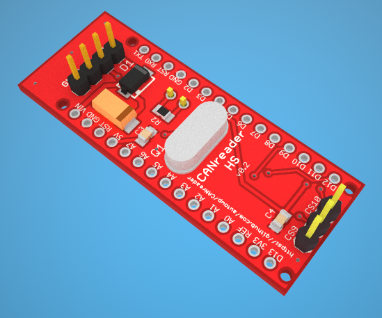
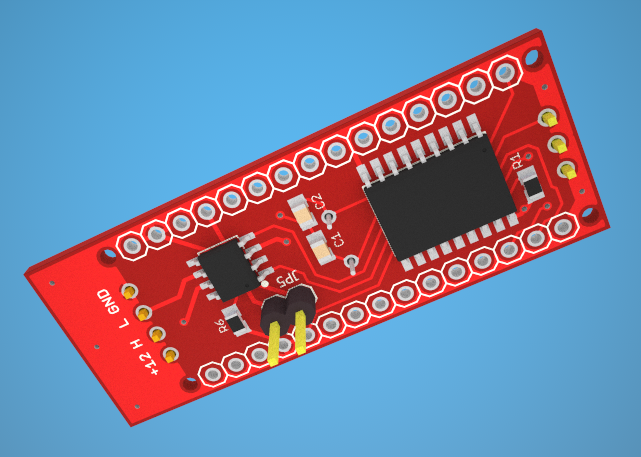

# CANreader HS




Used with Highspeed CAN

## Hardware

1. [Arduino Nano](https://www.arduino.cc/en/Main/ArduinoBoardNano)
2. CANreader-HS shield


## Software

[Arduino CANreader firmware](https://github.com/autowp/can-usb) (sketch) 

 - [CanHacker](http://www.mictronics.de/projects/usb-can-bus/) (Windows)
 - [CANreader](https://play.google.com/store/apps/details?id=com.autowp.canreader) (Android)

## Usage

Can be connected with

### CanHacker (windows)

1. USB
2. Bluetooth (via [HC-05 bluetooth receiver](http://www.ebay.com/sch/i.html?_nkw=HC-05%20bluetooth)) (planned)

### CANreader (android)

1. USB (USB-host required)
2. Bluetooth (via [HC-05 bluetooth receiver](http://www.ebay.com/sch/i.html?_nkw=HC-05%20bluetooth)) (planned)
3. Ethernet (via [arduino nano ethernet shield ENC28J60](http://www.ebay.com/sch/i.html?_nkw=arduino+nano+ENC28J60)) (planned)

## Bill of materials

```
Part     Value      Device           Package          Description
C1, C2   22pF       C-EUC0805        C0805            CAPACITOR, European symbol
C3, C4   0.1mF      C-EUC0805        C0805            CAPACITOR, European symbol
C6       22uF 25V   CPOL-EUSMCC      SMC_C            POLARIZED CAPACITOR, European symbol
D1       S1M        S1M              SMA
JP1, JP2            PINHD-1X15       1X15             PIN HEADER
JP3                 PINHD-1X4-1      1X04             PIN HEADER
JP4                 PINHD-1X3        1X03             PIN HEADER
JP5                 PINHD-1X2        1X02             PIN HEADER
Q1       16MHz      CRYSTALHC49S     HC49S            CRYSTAL
R1, R6   10K        R-EU_R0805       R0805            RESISTOR, European symbol
R2       120        R-EU_R0805       R0805            RESISTOR, European symbol
U1                  MCP2515          SOIC18W
U2                  MCP2551-I/SN     SOIC8
J1                  JUMPER                            CS selector
J2                  JUMPER                            CAN terminal resistor switch
```

# Сборка

Упрощенная схема платы

Что и чем можно заменить (про редкий кондесатор, про 15-16pin header, проходной pin-header)

Не забудьте соблюсти полярность диодов и тантала

Направление установки Arduino